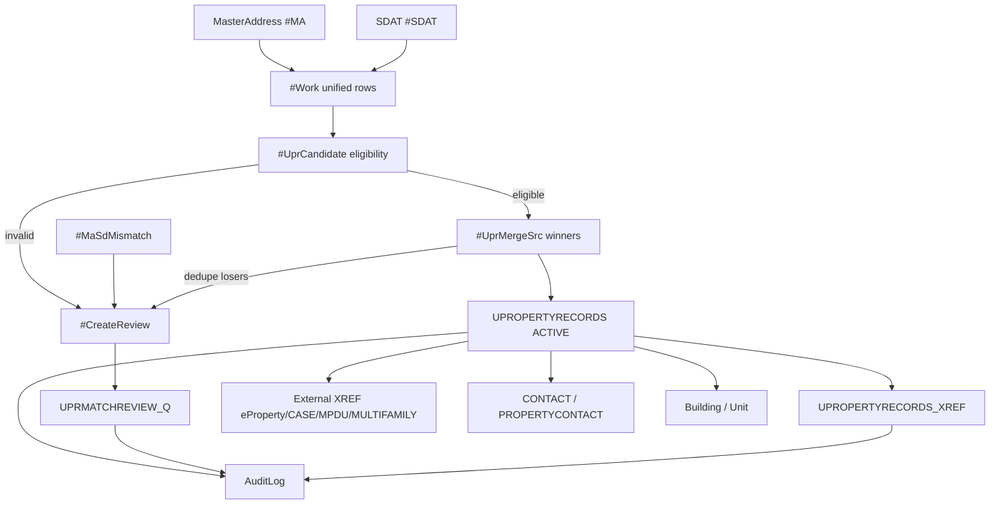

# UPR Master Load Script — Technical Walkthrough

**File:** `scripts/load_upr_master.sql`  
**Audience:** Production programmers, DBAs, integration engineers  
**Purpose:** Load MasterAddress + SDAT incoming data into `UPROPERTYRECORDS` (UPR), link source systems via XREF, route invalid rows to `UPRMATCHREVIEW_Q`, enrich with contacts/buildings/units, and audit everything.

**Execution model:** Single script, multiple `GO` batches. Normalization functions are created first (persist in DB). The main load runs inside **one transaction** (`BEGIN TRY` / `BEGIN TRANSACTION` … `COMMIT`). Schema repairs run **outside** the transaction so they survive rollback.

---

## High-Level Data Flow



**Core rule:** Every incoming source row gets **one disposition** — either **UPR** (fully valid unique property) or **Review_Q**. No placeholder/PENDING rows in UPR.

**Migration order (client-required):**

1. Combine MA + SDAT → `#IncomingUnified`
2. Dedupe to `#IncomingUnique` (one row per account + normalized address); extras → Review_Q `DUPLICATE`
3. From `#IncomingUnique`: valid → UPR; invalid → Review_Q
4. External systems match UPR by address only → XREF

Placeholder ParcelIDs (`0`, `0000`, all-zeros) are treated as missing (not real parcels).

---

## Client Business Rules (summary)

| Rule | Behavior |
|------|----------|
| MA↔SDAT match key | Account# **AND** normalized address only — **not** ParcelID |
| MA+SDAT full match | One UPR row if valid; else one Review_Q row with `IncomingSourceSystem = BOTH` |
| MA/SDAT partial overlap | Review_Q `Address or Account Not Match` — not UPR |
| UPR eligibility | Valid account + valid address + ParcelID |
| Review_Q reasons | `Missing ParcelID`, `Address or Account Not Match`, `NO_ADDRESS_MATCH`, `DUPLICATE` |
| IncomingSourceSystem | `ADDRESS_MASTER`, `KDAT`, or `BOTH` only |
| External systems | Address match only; always write XREF (`MATCH` or `NO_MATCH`); non-match does **not** go to Review_Q |
| Invalid records | Review_Q only — never PENDING or placeholder rows in UPR |

---

## Part A — Normalization Functions (before main batch)

Created with `CREATE OR ALTER FUNCTION` in separate `GO` batches. Must exist before load runs (preflight checks this).

| Function | Role |
|----------|------|
| `fn_UPR_StdStreetToken` | Standardizes street suffixes (STREET→ST, AVENUE→AVE, etc.) |
| `fn_UPR_NormalizeAddressLine` | Uppercase/trim address line; standardize last token as street type |
| `fn_UPR_NormalizeZipCode` | Strip non-digits; format as `#####` or `#####-####`; default `00000` |
| `fn_UPR_IsValidZipCode` | Rejects `00000` and malformed zips |
| `fn_UPR_NormalizeStreetNumber` | Strip leading zeros (`02456` → `2456`) |
| `fn_UPR_NormalizeSDATAccount` | Zero-pad numeric accounts to 8 digits for consistent joins/dedup |
| `fn_UPR_IsValidStreetNumber` | Rejects blank, `0`, non-positive numeric street numbers |
| `fn_UPR_NormalizeState` | 2-char uppercase A–Z; default `MD` |
| `fn_UPR_NormalizeFullAddressLine` | Street + city + 5-digit zip into one normalized line |

These enforce UPR DDL `CHECK` constraints **before** insert, reducing MERGE failures.

---

## Part B — Session Setup

```sql
SET NOCOUNT ON;
SET XACT_ABORT ON;
```

**Key variables:**

- `@Now` / `@BatchStartTime` — batch timestamp; used for idempotency filters and audit
- `@RunUser` / `@AuditUser` — `SUSER_SNAME()` for CreatedBy/ChangedBy
- `@DefaultState = 'MD'`, `@DefaultSdatPropertyType = 'CONDO'`
- ~30 summary counters (`@UPRActiveInserted`, `@ReviewDuplicate`, `@XrefCountBefore`, etc.) printed at end

**Dynamic column resolution:** `@RefUserCreateCol` / `@RefUserUpdateCol` detect `CreationUserID` vs `CreationUSERID` casing in REF tables.

---

## Part C — Schema Fix (outside transaction)

Runs **before** `BEGIN TRANSACTION`. Persists even if load fails.

1. **Rebuild `CK_UPRMATCHREVIEW_Q_ReasonForNoMatch`** — ensures allowed values include `DUPLICATE`, `Missing ParcelID`, `Address or Account Not Match`, `NO_ADDRESS_MATCH`, etc.
2. **Make `UPropertyRecords_XrefID` nullable** on `UPRMATCHREVIEW_Q` — rejected rows do not require a UPR parent row.
3. **Re-add FK** `FK_UPRMATCHREVIEW_Q_XREF` (nullable FK is valid in SQL Server).

Throws `50021` if DUPLICATE is not in the CHECK constraint after repair.

---

## Section 0 — Preflight

Validates environment **before any DML**:

- Required tables: `UPROPERTYRECORDS`, `UPROPERTYRECORDS_XREF`, `UPRMATCHREVIEW_Q`, `UPRSTATUSHISTORY`, `AuditLog`, REF tables
- Normalization functions exist
- `REF_MATCHCONFIDENCE.IsActive` column exists
- `REF_PROPERTYTYPE` audit columns exist
- `UPRMATCHREVIEW_Q` has client column set: `MA_Account`, `MA_NormalizedIncomingAddress`, `MA_ParcelID`, `SDAT_AccountNumber`, `SDAT_NormalizedIncomingAddress`, `SDAT_ParcelID`, `IncomingSourceSystem`, `ReasonForNoMatch`, `ReviewStatus`

Throws `50001`–`50005` with explicit messages on failure.

---

## Section 1 — Reference Data Seed

Idempotent `MERGE` into lookup tables:

- `REF_PROPERTYTYPE` (APT, CONDO, TH, MULTI, SF, LAND, MIXED) with `AllowsBuildings` / `AllowsUnits`
- `REF_PROPERTY_STATUSCODE` (ACTIVE, INACTIVE, PENDING, RETIRED) if table exists
- `REF_SOURCESYSTEM`, `REF_MATCHMETHOD`, `REF_MATCHCONFIDENCE`

All seeds set `IsActive`, audit user IDs, and dates. Safe to re-run.

---

## Section 2 — Normalize MasterAddress → `#MA`

Reads from `dbo.MAIncomingTableX1` (client staging; production uses `DHCA_Internal.dbo.MasterAddress`).

**Per row:**

- Normalize account via `fn_UPR_NormalizeSDATAccount`
- Build `NormalizedStreetAddress` and `NormalizedFullAddress`
- Map `LUCategory` → `PropertyType` (CONDO, MULTI, SF, LAND, TH, MIXED)
- Compute `HasRequiredAddress` (street name, city, valid street number, valid zip)
- Extract lat/long from MA coordinates

Wrapped in `TRY/CATCH` — failure throws `50010` (MA is required).

Sets `@MasterAddressRead`.

---

## Section 3 — Normalize SDAT → `#SDAT`

Reads from `dbo.SDATIncomingTableX1` (production: `DHCA_Internal.dbo.RealPropertyTaxInformation`).

Similar normalization. SDAT has no `Unit` or `LUCategory` — defaults `PropertyType = CONDO`. Owner name comes from SDAT.

`TRY/CATCH` — failure throws `50011`.

Sets `@SDATRead`.

---

## Section 4 — Match MA ↔ SDAT → `#Work`

This is the **unification layer**. One `#Work` row = one logical incoming property.

### 4.0 — Full match detection (`#MaSdMatch` → `#MaSdBest`)

**Match key:** `Account#` **AND** (`NormalizedStreetAddress` OR `NormalizedFullAddress` match).  
**ParcelID is NOT part of the match key.**

`ROW_NUMBER` picks one best pair per MA row and per SDAT row (1:1 pairing).

### 4.1 — Mismatch detection (`#MaSdMismatch`)

Pairs where **only account** or **only address** overlaps (not both):

- `MismatchType = 'ACCOUNT'` — same account, different address
- `MismatchType = 'ADDRESS'` — same address, different account

These go to Review_Q later (not `#Work`). Count stored in `@MaSdMismatchCount`.

### 4.2 — Build `#Work` (three inserts)

| Sub-step | MatchSource | Contents |
|----------|-------------|----------|
| **4a** | `BOTH` | MA+SDAT matched on account+address; coalesce fields (MA property type, SDAT owner/parcel) |
| **4b** | `ADDRESS_MASTER` | MA rows not in `#MaSdBest` or `#MaSdMismatch` |
| **4c** | `KDAT` | SDAT-only rows not paired |

`@IncomingUnifiedRows = COUNT(#Work)`.

Indexes on `MasterAddressID` and `KdatRecordID` for downstream joins.

---

## Section 5 — UPR Insert Pipeline

This is the largest section. It does **not** insert directly from `#Work` — it filters, dedupes, and guards first.

### 5.0 — `#UprCandidate` — eligibility flags

Built from `#Work`. Computes effective fields for UPR insert:

- `EffectiveSDATAccountNumber` — normalized account (real account required; no synthetic keys)
- `EffectiveParcelID` — trimmed parcel (required for UPR)
- Effective address components, property type, owner, lat/long

**`IsEligibleForUpr = 1` only when ALL are true:**

- Valid account number
- Valid street number, street name, city, zip
- **ParcelID present**

**`NeedsNoParcelReview = 1`** when account+address valid but parcel missing → Review_Q `Missing ParcelID`.

### 5.1 — `#CreateReview` staging (starts here, grows through section 5)

`#CreateReview` is the **Review_Q staging table**. It mirrors `UPRMATCHREVIEW_Q` columns plus internal keys (`MasterAddressID`, `KdatRecordID`, `ReviewDetail`).

Rows are added from multiple paths (priority matters):

1. **`#MaSdMismatch`** → `ReasonForNoMatch = 'Address or Account Not Match'`, `IncomingSourceSystem = 'BOTH'`
2. **Ineligible `#UprCandidate`** (`IsEligibleForUpr = 0`) → `Missing ParcelID` or `NO_ADDRESS_MATCH`
3. **MERGE safety failures** → `NO_ADDRESS_MATCH`
4. **Eligible duplicates that did not win UPR** (after UQ guard + winner promotion) → `DUPLICATE`

`@UprCountBefore` captured here (UPR table count before MERGE).

### 5.2 — `#UprMergeRanked` and `#UprMergeSrc`

From eligible candidates (`IsEligibleForUpr = 1`):

```sql
ROW_NUMBER() OVER (
  PARTITION BY EffectiveSDATAccountNumber, NormalizedFullAddress
  ORDER BY BOTH > KDAT > ADDRESS_MASTER, parcel present, owner present, then IDs
) AS PropertyRn
```

**All** eligible rows enter `#UprMergeSrc` (with `PropertyRn` for ranking). The final UPR winner per account+address is chosen **after** the UQ guard, not by `PropertyRn = 1` alone.

### 5.3 — Duplicate-key guard (`#UprMergeScored` / `#UprMergeLosers` / `#UprMergeWinners`)

Before MERGE, enforces UPR unique constraints:

| Constraint | Detection |
|------------|-----------|
| `UQ_UPropertyRecords_SDATAccountNumber` | `BatchAccountRn > 1` |
| `UQ_UPropertyRecords_Address` | `BatchAddrRn > 1` (street# + name + type + zip) |
| `UQ_UPropertyRecords_ParcelID` | `BatchParcelRn > 1` |
| Existing UPR address conflict | Join `#ExistingUprKeys` on address, different account |
| Existing UPR parcel conflict | Join `#ExistingUprKeys` on parcel, different account |

`#UprMergeLosers` flags rows that would violate a UQ constraint.

`#UprMergeWinners` picks the **best surviving candidate** per account+address partition — preferring rows **not** in `#UprMergeLosers`, then BOTH > KDAT > MA, parcel, owner, `PropertyRn`. This promotes a valid duplicate when the first-ranked row lost the UQ guard.

**Cascade pick** (replaces parallel row-number AND filter):

1. `#UprMergeAddrWin` — account+address winners (`FinalWinnerRn = 1`)
2. `#UprMergeAcctWin` — one row per `EffectiveSDATAccountNumber`
3. `#UprMergeAddrKeyWin` — one row per physical address key
4. `#UprMergeParcelWin` — one row per `EffectiveParcelID` (when present)

`#UprMergeSrc` is rebuilt from the cascade survivors. This avoids excluding a promoted duplicate because a sibling row in the same duplicate group lost on parcel rank.

Remaining eligible rows in `#UprMergeRanked` that are not in `#UprMergeSrc` → `#CreateReview` as `DUPLICATE` (exact source key match only).

### 5.4 — `#CreateReview` deduplication

`ROW_NUMBER` over `(MasterAddressID, KdatRecordID, ReasonForNoMatch)` → keep one row per source+reason.

- `TRUNCATE #CreateReview` + `INSERT` from deduped set (avoids temp-table recreate error)
- DELETE DUPLICATE rows when a higher-priority reason exists for same keys

### 5.5 — Pre-MERGE hard stops

Throws if `#UprMergeSrc` still has duplicate account, address, or parcel keys (`50030`–`50032`).

### 5.6 — `#UprMergeReady` + MERGE into `UPROPERTYRECORDS`

Adds `ParcelConflict` flag when new parcel would collide with existing UPR parcel on different account.

**MERGE key:** `SDATAccountNumber = EffectiveSDATAccountNumber`

- **WHEN NOT MATCHED** → INSERT with `PropertyStatusCode = 'ACTIVE'`, `IsActive = 1`
- **WHEN MATCHED** → UPDATE owner, lat/long, property type, parcel (guarded on conflict)

`@UPRActiveInserted` = new ACTIVE rows this run. **Only fully valid properties land in UPR.**

### 5.7 — `#UPRMap` + Status History

`#UPRMap` links each MERGE winner back to source IDs (`MasterAddressID`, `KdatRecordID`, `MatchSource`, `Unit`).

`UPRSTATUSHISTORY` insert for new records only (`IsNew = 1`), idempotent via `NOT EXISTS` on change reason.

Duplicate map rows collapsed before XREF writes.

---

## Section 6 — Incoming Source XREF (MA / SDAT)

For each row in `#UPRMap` with a source ID:

| Source | SourceSystemCode | SourceEntityType |
|--------|------------------|------------------|
| MA | `ADDRESS_MASTER` | `MasterAddress` |
| SDAT | `KDAT` | `SDATProperty` |

- `MatchResult = 'MATCH'`, `MatchConfidence = 'HIGH'`, `ProcessingStatus = 'PROCESSED'`
- Deduped by source record ID (`ROW_NUMBER` per source)
- Idempotent: `NOT EXISTS` on active XREF for same source key

`@XrefCountBefore` captured at start of section 6.

---

## Section 6b / 6c — Review_Q (`UPRMATCHREVIEW_Q`)

**No PENDING UPR rows.** Invalid data goes here only.

### Validation gates

- Allowed `ReasonForNoMatch` values only (`50036`)
- CHECK constraint includes DUPLICATE (`50037`)
- Required column values present (`50038`)

### Optional rejected XREF (duplicate losers only)

For `DUPLICATE` rows where an ACTIVE UPR winner exists (from `#UprMergeSrc` for the same account+address):

- Insert `UPROPERTYRECORDS_XREF` with `MatchResult = 'REJECTED'`
- Link to the promoted winning UPR property

### Review_Q insert

`#ReviewQReady` ← all `#CreateReview` rows  
`UPropertyRecords_XrefID` = NULL unless duplicate XREF was created

Insert into `UPRMATCHREVIEW_Q` with idempotent `NOT EXISTS` on natural key:
`(IncomingSourceSystem, MA_Account, MA_NormalizedIncomingAddress, SDAT_AccountNumber, SDAT_NormalizedIncomingAddress, ReasonForNoMatch)`

**Review_Q reason breakdown (typical 50k run):**

| Reason | Meaning |
|--------|---------|
| Missing ParcelID | Account+address OK, no parcel |
| Address or Account Not Match | MA/SDAT partial overlap |
| NO_ADDRESS_MATCH | Bad/incomplete data |
| DUPLICATE | Extra source rows sharing account+address with a winner |

---

## Section 7 — External System XREF

Sources (via dynamic SQL + `TRY/CATCH` — failures warn, don't abort):

- eProperty (`DHCA_LicensingAndRegistration.dbo.Property`)
- CASE (`DHCA_OLTA.dbo.[Case]`)
- MPDU (`DHCA_MPDU.dbo.Development`)
- MULTIFAMILY (`DHCA_MultifamilyLoans.dbo.Address`)

Normalized addresses staged in `#ExtAddr`.

**For each ACTIVE UPR row × each external system:**

- Address match on `NormalizedStreetAddress` OR `NormalizedFullAddress`
- Always writes one XREF per UPR per system: `MATCH` or `NO_MATCH`
- External non-match does **not** go to Review_Q

---

## Section 8 — Contact + PropertyContact

- Distinct SDAT `OwnerName` → `CONTACT` (type OWNER)
- Link to UPR via `PROPERTYCONTACT` where owner exists in `#Work`

---

## Section 10 — Building + Unit (CONDO/APT)

For UPR rows where `REF_PROPERTYTYPE.AllowsBuildings = 1` and `AllowsUnits = 1`:

- Insert `Building` code `MAIN` if missing
- Insert `Unit` from MA `Unit` column (or default `U1`)
- Deduped on `(UPropertyRecordsID, UnitNumber)`

---

## Section 11 — AuditLog

One audit row per insert in this batch:

```
UPROPERTYRECORDS      → 'UPR load - record created'
UPROPERTYRECORDS_XREF → 'XREF: {system}/{id} {result}'
UPRMATCHREVIEW_Q      → 'Review: {reason}'
```

**AuditLog count = UPR + XREF + Review_Q** (e.g. 2,251 + 12,252 + 90,048 = 104,551). This is expected — not duplicate business records.

---

## Section 12 — Summary Report

Vertical `PRINT` statements only (SSMS Messages tab). Key lines:

- Source reads (MA, SDAT)
- Unified rows + mismatch pairs
- **UPR eligible rows** (account + address + parcel)
- **UPR table count before/after**
- **UPR rows written this run** (ACTIVE only)
- Review_Q breakdown by reason
- XREF before/after/delta
- Reconciliation check: `UPR + Review_Q ≈ incoming disposition total`
- Building, Unit, Contact, AuditLog counts

On error: `ROLLBACK TRANSACTION`, print error number/line/message, attempt failure `AuditLog` insert.

---

## Temp Table Pipeline

| Temp table | Purpose |
|------------|---------|
| `#MA` / `#SDAT` | Normalized staging |
| `#MaSdMatch` / `#MaSdBest` | Full MA↔SDAT pairs |
| `#MaSdMismatch` | Partial overlaps → Review |
| `#Work` | Unified incoming rows |
| `#UprCandidate` | Eligibility evaluation |
| `#UprMergeRanked` | Account+address ranking |
| `#UprMergeSrc` | UPR MERGE winners |
| `#UprMergeScored` / `#UprMergeLosers` | Unique-key guard |
| `#CreateReview` | Review_Q staging |
| `#UprMergeReady` | Final MERGE input |
| `#UPRMap` | UPR ↔ source linkage |
| `#ReviewQReady` | Final Review_Q insert |
| `#ExtAddr` / `#ExtMatch` | External address matching |

---

## Idempotency Patterns

| Pattern | Where used |
|---------|------------|
| `MERGE` on `SDATAccountNumber` | UPR upsert |
| `NOT EXISTS` on source XREF keys | MA/SDAT/external XREF |
| `NOT EXISTS` on Review_Q natural key | Review_Q |
| `NOT EXISTS` on status history reason | UPRSTATUSHISTORY |
| `NOT EXISTS` on building/unit/contact | Child tables |
| REF `MERGE` | Lookup seeds |

Re-run on same data **skips** already-inserted rows. Counts in summary will differ on re-run (expected NOTE in report).

---

## Error Code Reference

| Code | Meaning |
|------|---------|
| 50001 | Missing required tables |
| 50002 | Normalization functions missing |
| 50003–50005 | Schema/column preflight failures |
| 50010–50011 | MA/SDAT source read failure |
| 50021 | Review_Q CHECK repair failed |
| 50030–50032 | Duplicate keys in MERGE candidates |
| 50036–50038 | Review_Q validation blocked |

---

## Expected Counts (50k MA + 50k SDAT test)

| Metric | Typical value |
|--------|---------------|
| Unified `#Work` rows | ~91,313 |
| MA/SDAT mismatch pairs | ~986 |
| Incoming disposition total | ~92,299 |
| UPR ACTIVE inserted | ~2,251 |
| Review_Q inserted | ~90,048 |
| XREF total | ~12,252 |
| AuditLog | ~104,551 (= UPR + XREF + Review_Q) |

---

## Related Scripts

| Script | Purpose |
|--------|---------|
| `scripts/load_upr_master.sql` | Main load (this document) |
| `scripts/search_upr_master.sql` | Parameterized UPR / XREF / Review_Q search |
| `scripts/02_review_q_client_alter.sql` | One-time Review_Q schema verification |
| `test/static_check_load.py` | Static analysis without SQL Server |

---

## Search Script

`scripts/search_upr_master.sql` — parameterized search across:

- `UPROPERTYRECORDS` (with optional `Unit` display)
- `UPROPERTYRECORDS_XREF`
- `UPRMATCHREVIEW_Q` (MA + SDAT column set)

Filters include account (SDAT-normalized), parcel, address, owner, property type/status, source system, Review_Q reason, and `IncomingSourceSystem`. Set `@IncludeReviewQOnly = 1` to search Review_Q only.
